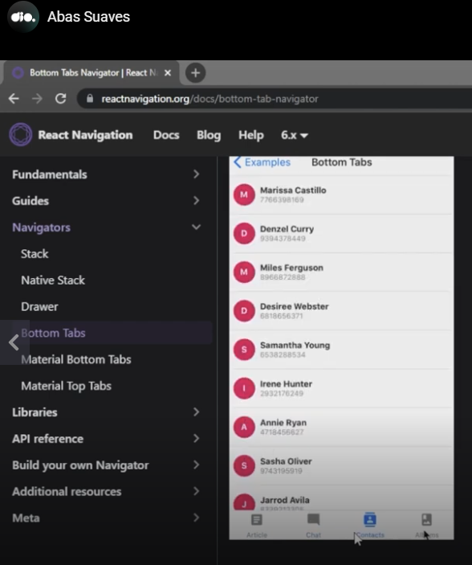
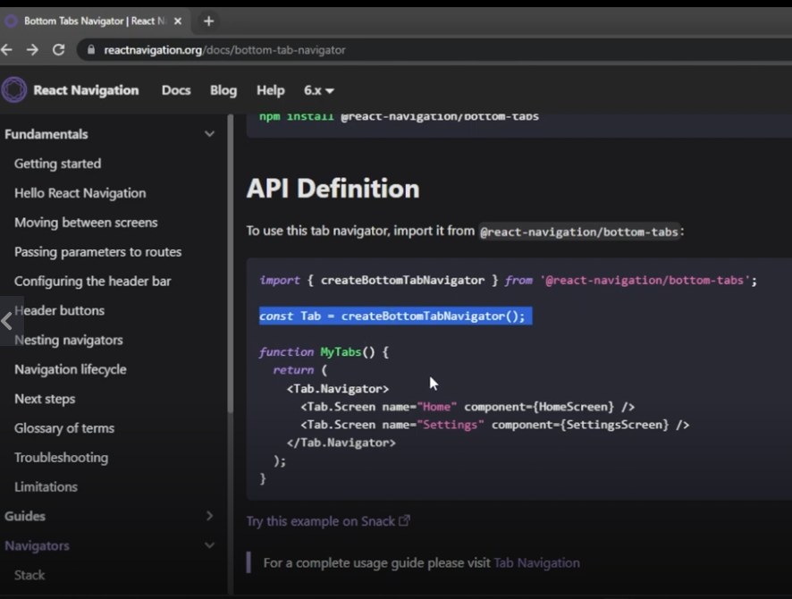
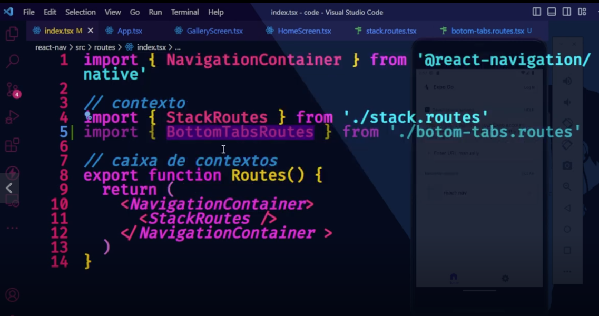
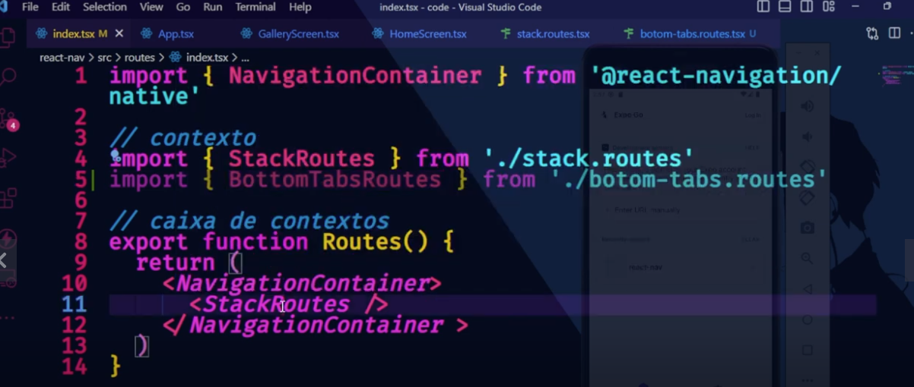
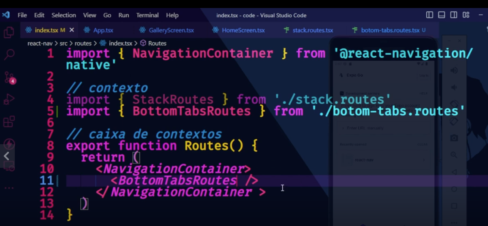

# Introduction

Teacher said that tab navigation is similar to stack navigation.


# Bottom tabs navigation


## Material bottom




# Material top


# Installation

Teacher instructed us to run the following command **after** initialized an application (to install the navigation **bottom**-tabs):

```
npm install @react-navigation/botton-tabs
```

To setup an application please see [this repository](https://github.com/andreterceiro/dio-mobile-meu-tudo--working-with-stack-navigation-in-react-native).

Teacher said that he do slightly different from the documentation. From the documentation:



Teacher created a file routes/bottom-tabs-routes.tsx (with a slightly typo - botom).


# Most simple example

Teacher said that this is the most simple example of this type of navigation:


# Test apps

I also explored [the documentation](https://reactnavigation.org/docs/bottom-tab-navigator/) and created 2 test apps. First, tests/01/botton-tabs, I created with the command:

```
npx create-expo-app botttom-tabs
```

For the second app (tests/02/bottom), I used the parameter -t and selected the template "blank (Typescript)":

```
npx create-expo-app botttom -t
```

You can run the app with the apps Vysor (to see the app in the PC) and Expo through this commmand:

```
npm run android
```

**OBS:** you need to run this command inside the created app directory.

As you can see in the first demo app, the bottom tabs navigation was created on this app, but it wasn't me that created this navigation on the app. It was the command `npx create-expo-app botttom-tabs`.

At least initially I did not understand the example because as you can see in some demo code of the [documentation page](https://reactnavigation.org/docs/bottom-tab-navigator/), the constant "MyTabs" seems not be used, see:

```typescript
import { View, Platform } from 'react-native';
import { useLinkBuilder, useTheme } from '@react-navigation/native';
import { Text, PlatformPressable } from '@react-navigation/elements';
import { createBottomTabNavigator } from '@react-navigation/bottom-tabs';

function MyTabBar({ state, descriptors, navigation }) {
  const { colors } = useTheme();
  const { buildHref } = useLinkBuilder();

  return (
    <View style={{ flexDirection: 'row' }}>
      {state.routes.map((route, index) => {
        const { options } = descriptors[route.key];
        const label =
          options.tabBarLabel !== undefined
            ? options.tabBarLabel
            : options.title !== undefined
              ? options.title
              : route.name;

        const isFocused = state.index === index;

        const onPress = () => {
          const event = navigation.emit({
            type: 'tabPress',
            target: route.key,
            canPreventDefault: true,
          });

          if (!isFocused && !event.defaultPrevented) {
            navigation.navigate(route.name, route.params);
          }
        };

        const onLongPress = () => {
          navigation.emit({
            type: 'tabLongPress',
            target: route.key,
          });
        };

        return (
          <PlatformPressable
            href={buildHref(route.name, route.params)}
            accessibilityState={isFocused ? { selected: true } : {}}
            accessibilityLabel={options.tabBarAccessibilityLabel}
            testID={options.tabBarButtonTestID}
            onPress={onPress}
            onLongPress={onLongPress}
            style={{ flex: 1 }}
          >
            <Text style={{ color: isFocused ? colors.primary : colors.text }}>
              {label}
            </Text>
          </PlatformPressable>
        );
      })}
    </View>
  );
}

const MyTabs = createBottomTabNavigator({
  tabBar: (props) => <MyTabBar {...props} />,
  screens: {
    Home: HomeScreen,
    Profile: ProfileScreen,
  },
});
```

Teacher did a very small example. He did not create the screens (we already have the screens from the code we developed [when studied stack navigation](https://github.com/andreterceiro/dio-mobile-meu-tudo--working-with-stack-navigation-in-react-native/)).

First, he created a file src/routes/bottom-tabs.routes.tsx:



Second, he created a file src/routes/index.tsx. The app changed from:



To:



**OBS:** both files commented above are stored inside the directory "src/routes" in the Teacher's example.


# Destrucuring the value returned by the function creatingBottomTabNavgator()

Teacher change a code from:


To:

